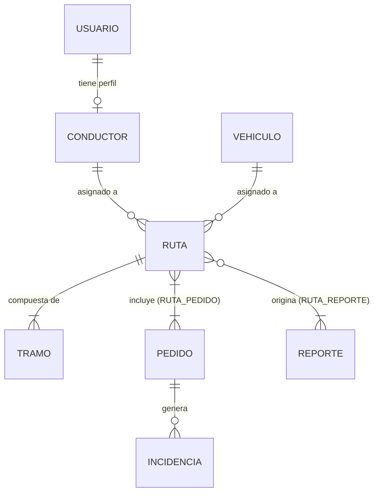

# 11. Diseño e Ingeniería de Base de Datos

## 1. Datos generales

| Campo | Información |
|---|---|
| **Proyecto** | EcoLogística Lima – Optimizador de Rutas Sostenibles para DistriRápido S.A.C. |
| **Responsable** | Ore Campos, Josef Pablo |
| **Fecha** | 04/09/2026 |
| **Versión** | 1.0.0 |

---

## 2. Modelo Conceptual — Diagrama Entidad-Relación

El modelo conceptual identifica las entidades principales del sistema y sus relaciones, derivadas del alcance definido en el Acta de Constitución (RF-01 a RF-07).

### Entidades principales

| Entidad | Descripción |
|---|---|
| **USUARIO** | Representa a los actores del sistema (administrador, operador, conductor). |
| **CONDUCTOR** | Perfil específico del conductor, asociado a un usuario del sistema. |
| **VEHÍCULO** | Vehículos de la flota de DistriRápido S.A.C. |
| **PEDIDO** | Unidad de entrega con dirección, ventana de tiempo, peso y estado. |
| **RUTA** | Solución generada por el algoritmo para un conjunto de pedidos y vehículos. |
| **TRAMO** | Segmento individual de una ruta entre dos puntos de entrega. |
| **ZONA_RESTRINGIDA** | Áreas de alto riesgo o ambientalmente sensibles excluidas del enrutamiento. |
| **REPORTE** | Reportes de sostenibilidad e indicadores operativos generados por el sistema. |
| **INCIDENCIA** | Registro de problemas reportados por el conductor durante la jornada. |

### Relaciones principales

- Un **USUARIO** puede tener un **CONDUCTOR** asociado (relación 1:1 opcional).
- Un **CONDUCTOR** puede estar asignado a múltiples **RUTAS** (1:N).
- Un **VEHÍCULO** puede estar asignado a múltiples **RUTAS** (1:N).
- Una **RUTA** contiene múltiples **TRAMOS** (1:N).
- Una **RUTA** incluye múltiples **PEDIDOS** (N:M a través de tabla intermedia RUTA_PEDIDO).
- Un **PEDIDO** puede generar múltiples **INCIDENCIAS** (1:N).
- Un **REPORTE** se genera a partir de una o múltiples **RUTAS** (N:M).



---

## 3. Modelo Lógico — Especificación de Entidades

Nivel de normalización alcanzado: **Tercera Forma Normal (3FN)**.

### USUARIO

| Atributo | Tipo | Restricción |
|---|---|---|
| usuario_id | UUID | PK |
| email | VARCHAR(255) | NOT NULL, UNIQUE |
| password_hash | VARCHAR(255) | NOT NULL |
| rol | VARCHAR(20) | NOT NULL (ADMIN / OPERADOR / CONDUCTOR / AUDITOR) |
| estado | VARCHAR(20) | NOT NULL DEFAULT 'ACTIVO' |
| creado_en | TIMESTAMP WITH TIME ZONE | DEFAULT CURRENT_TIMESTAMP |

### CONDUCTOR

| Atributo | Tipo | Restricción |
|---|---|---|
| conductor_id | UUID | PK |
| usuario_id | UUID | FK → USUARIO(usuario_id) |
| nombre_completo | VARCHAR(200) | NOT NULL |
| licencia | VARCHAR(50) | NOT NULL, UNIQUE |
| telefono | VARCHAR(20) | |
| estado | VARCHAR(20) | NOT NULL DEFAULT 'DISPONIBLE' |

### VEHÍCULO

| Atributo | Tipo | Restricción |
|---|---|---|
| vehiculo_id | UUID | PK |
| placa | VARCHAR(10) | NOT NULL, UNIQUE |
| capacidad_kg | DECIMAL(10,2) | NOT NULL |
| capacidad_m3 | DECIMAL(10,2) | |
| tipo_combustible | VARCHAR(30) | NOT NULL |
| estado | VARCHAR(20) | NOT NULL DEFAULT 'DISPONIBLE' |
| creado_en | TIMESTAMP WITH TIME ZONE | DEFAULT CURRENT_TIMESTAMP |

### PEDIDO

| Atributo | Tipo | Restricción |
|---|---|---|
| pedido_id | UUID | PK |
| cliente_nombre | VARCHAR(200) | NOT NULL |
| direccion_entrega | TEXT | NOT NULL |
| latitud | DECIMAL(10,7) | NOT NULL |
| longitud | DECIMAL(10,7) | NOT NULL |
| peso_kg | DECIMAL(10,2) | NOT NULL |
| ventana_inicio | TIME | NOT NULL |
| ventana_fin | TIME | NOT NULL |
| prioridad | VARCHAR(20) | NOT NULL DEFAULT 'ESTANDAR' |
| estado | VARCHAR(20) | NOT NULL DEFAULT 'PENDIENTE' |
| creado_en | TIMESTAMP WITH TIME ZONE | DEFAULT CURRENT_TIMESTAMP |

> **Nota:** El campo `prioridad` (URGENTE / ESTANDAR) está reservado pendiente de la definición de la RN-010 por el equipo.

### RUTA

| Atributo | Tipo | Restricción |
|---|---|---|
| ruta_id | UUID | PK |
| conductor_id | UUID | FK → CONDUCTOR(conductor_id) |
| vehiculo_id | UUID | FK → VEHÍCULO(vehiculo_id) |
| fecha_operacion | DATE | NOT NULL |
| distancia_total_km | DECIMAL(10,2) | |
| tiempo_estimado_min | INTEGER | |
| combustible_estimado_l | DECIMAL(10,2) | |
| co2_estimado_kg | DECIMAL(10,2) | |
| estado | VARCHAR(20) | NOT NULL DEFAULT 'GENERADA' |
| generada_en | TIMESTAMP WITH TIME ZONE | DEFAULT CURRENT_TIMESTAMP |

### RUTA_PEDIDO (tabla intermedia N:M)

| Atributo | Tipo | Restricción |
|---|---|---|
| ruta_id | UUID | FK → RUTA(ruta_id), parte de PK compuesta |
| pedido_id | UUID | FK → PEDIDO(pedido_id), parte de PK compuesta |
| orden_entrega | INTEGER | NOT NULL |

### INCIDENCIA

| Atributo | Tipo | Restricción |
|---|---|---|
| incidencia_id | UUID | PK |
| pedido_id | UUID | FK → PEDIDO(pedido_id) |
| conductor_id | UUID | FK → CONDUCTOR(conductor_id) |
| tipo | VARCHAR(50) | NOT NULL |
| descripcion | TEXT | |
| reportada_en | TIMESTAMP WITH TIME ZONE | DEFAULT CURRENT_TIMESTAMP |

---

## 4. Modelo Físico — DDL SQL e Índices

```sql
-- ======================================================
-- EcoLogística Lima – Script DDL v1.0.0
-- Base de datos: PostgreSQL 15+
-- Nivel de normalización: 3FN
-- ======================================================

CREATE TABLE usuarios (
    usuario_id   UUID         PRIMARY KEY DEFAULT gen_random_uuid(),
    email        VARCHAR(255) NOT NULL UNIQUE,
    password_hash VARCHAR(255) NOT NULL,
    rol          VARCHAR(20)  NOT NULL CHECK (rol IN ('ADMIN','OPERADOR','CONDUCTOR','AUDITOR')),
    estado       VARCHAR(20)  NOT NULL DEFAULT 'ACTIVO',
    creado_en    TIMESTAMP WITH TIME ZONE DEFAULT CURRENT_TIMESTAMP
);

CREATE INDEX idx_usuarios_email ON usuarios(email);
CREATE INDEX idx_usuarios_rol   ON usuarios(rol);

-- --------------------------------------------------------

CREATE TABLE conductores (
    conductor_id   UUID         PRIMARY KEY DEFAULT gen_random_uuid(),
    usuario_id     UUID         NOT NULL REFERENCES usuarios(usuario_id) ON DELETE CASCADE,
    nombre_completo VARCHAR(200) NOT NULL,
    licencia       VARCHAR(50)  NOT NULL UNIQUE,
    telefono       VARCHAR(20),
    estado         VARCHAR(20)  NOT NULL DEFAULT 'DISPONIBLE'
);

CREATE INDEX idx_conductores_usuario ON conductores(usuario_id);

-- --------------------------------------------------------

CREATE TABLE vehiculos (
    vehiculo_id      UUID          PRIMARY KEY DEFAULT gen_random_uuid(),
    placa            VARCHAR(10)   NOT NULL UNIQUE,
    capacidad_kg     DECIMAL(10,2) NOT NULL,
    capacidad_m3     DECIMAL(10,2),
    tipo_combustible VARCHAR(30)   NOT NULL,
    estado           VARCHAR(20)   NOT NULL DEFAULT 'DISPONIBLE',
    creado_en        TIMESTAMP WITH TIME ZONE DEFAULT CURRENT_TIMESTAMP
);

-- --------------------------------------------------------

CREATE TABLE pedidos (
    pedido_id         UUID          PRIMARY KEY DEFAULT gen_random_uuid(),
    cliente_nombre    VARCHAR(200)  NOT NULL,
    direccion_entrega TEXT          NOT NULL,
    latitud           DECIMAL(10,7) NOT NULL,
    longitud          DECIMAL(10,7) NOT NULL,
    peso_kg           DECIMAL(10,2) NOT NULL,
    ventana_inicio    TIME          NOT NULL,
    ventana_fin       TIME          NOT NULL,
    prioridad         VARCHAR(20)   NOT NULL DEFAULT 'ESTANDAR',
    estado            VARCHAR(20)   NOT NULL DEFAULT 'PENDIENTE',
    creado_en         TIMESTAMP WITH TIME ZONE DEFAULT CURRENT_TIMESTAMP
);

CREATE INDEX idx_pedidos_estado    ON pedidos(estado);
CREATE INDEX idx_pedidos_prioridad ON pedidos(prioridad);

-- --------------------------------------------------------

CREATE TABLE rutas (
    ruta_id                  UUID          PRIMARY KEY DEFAULT gen_random_uuid(),
    conductor_id             UUID          NOT NULL REFERENCES conductores(conductor_id),
    vehiculo_id              UUID          NOT NULL REFERENCES vehiculos(vehiculo_id),
    fecha_operacion          DATE          NOT NULL,
    distancia_total_km       DECIMAL(10,2),
    tiempo_estimado_min      INTEGER,
    combustible_estimado_l   DECIMAL(10,2),
    co2_estimado_kg          DECIMAL(10,2),
    estado                   VARCHAR(20)   NOT NULL DEFAULT 'GENERADA',
    generada_en              TIMESTAMP WITH TIME ZONE DEFAULT CURRENT_TIMESTAMP
);

CREATE INDEX idx_rutas_conductor       ON rutas(conductor_id);
CREATE INDEX idx_rutas_fecha_operacion ON rutas(fecha_operacion);

-- --------------------------------------------------------

CREATE TABLE ruta_pedido (
    ruta_id       UUID    NOT NULL REFERENCES rutas(ruta_id)  ON DELETE CASCADE,
    pedido_id     UUID    NOT NULL REFERENCES pedidos(pedido_id) ON DELETE CASCADE,
    orden_entrega INTEGER NOT NULL,
    PRIMARY KEY (ruta_id, pedido_id)
);

-- --------------------------------------------------------

CREATE TABLE incidencias (
    incidencia_id UUID PRIMARY KEY DEFAULT gen_random_uuid(),
    pedido_id     UUID         NOT NULL REFERENCES pedidos(pedido_id),
    conductor_id  UUID         NOT NULL REFERENCES conductores(conductor_id),
    tipo          VARCHAR(50)  NOT NULL,
    descripcion   TEXT,
    reportada_en  TIMESTAMP WITH TIME ZONE DEFAULT CURRENT_TIMESTAMP
);

CREATE INDEX idx_incidencias_pedido    ON incidencias(pedido_id);
CREATE INDEX idx_incidencias_conductor ON incidencias(conductor_id);
```

> **Pendiente de definición por el equipo:** Una vez seleccionado el stack tecnológico (Documento 10), se deberá evaluar si se incorpora la extensión **PostGIS** para el almacenamiento nativo de coordenadas geográficas (tipo `GEOMETRY`) y la gestión de zonas restringidas. También deberán definirse las tablas de `REPORTE`, `ZONA_RESTRINGIDA` y `TRAMO` en la versión V_1_1_0 de este documento.

---

## 5. Control de versiones del documento

| Versión | Fecha | Autor | Cambios |
|---|---|---|---|
| 1.0.0 | 04/09/2026 | Rojas Camayo, Valentino Jhan Pierre | Versión inicial: modelo conceptual, lógico (3FN) y físico DDL de entidades principales. Pendiente: tablas REPORTE, ZONA_RESTRINGIDA, TRAMO y evaluación de PostGIS. |
