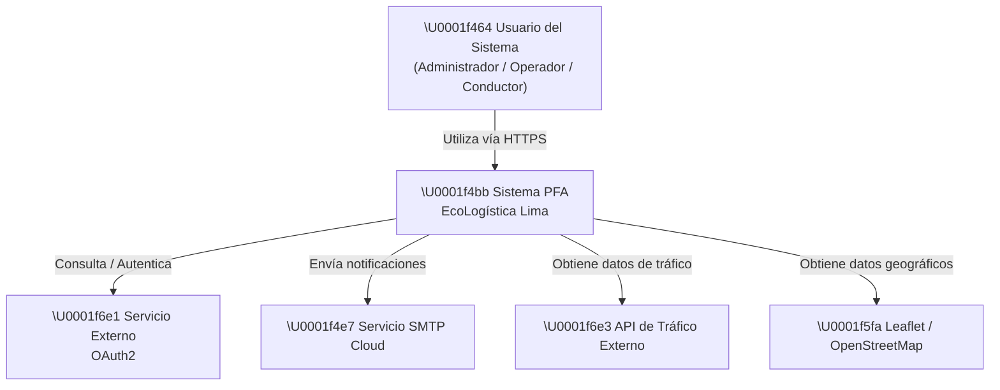
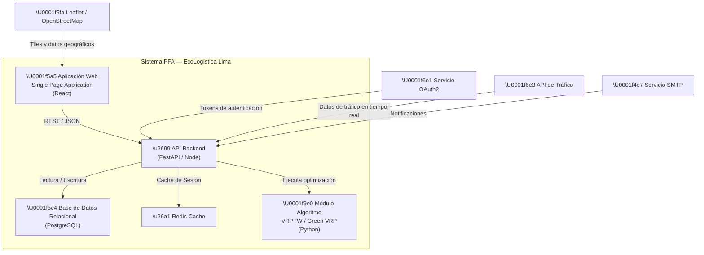
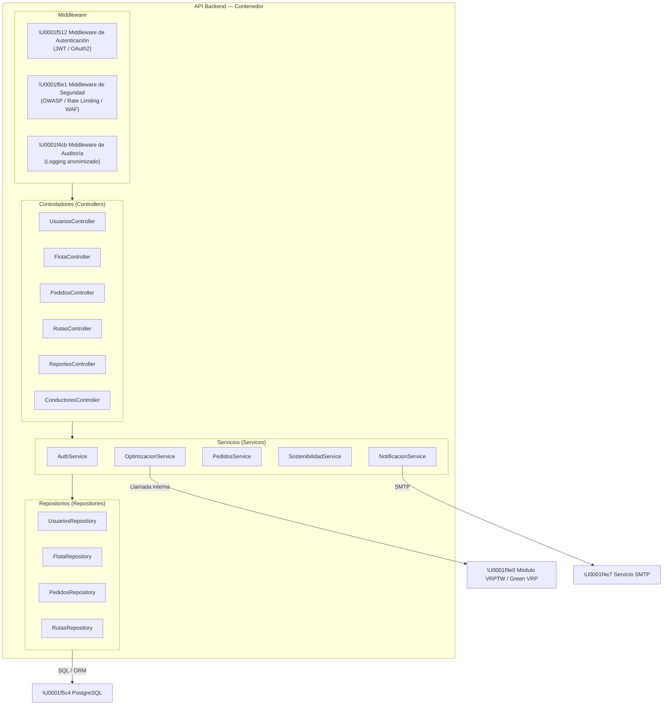

# 12. Arquitectura de Software — Modelo C4

## 1. Datos generales

| Campo | Información |
|---|---|
| **Proyecto** | EcoLogística Lima – Optimizador de Rutas Sostenibles para DistriRápido S.A.C. |
| **Responsable** | Ore Campos, Josef Pablo |
| **Fecha** | 04/09/2026 |
| **Versión** | 1.0.0 |

---

## 2. Nivel 1 — Diagrama de Contexto

Muestra el sistema EcoLogística Lima en relación con sus usuarios y los sistemas externos con los que interactúa.

> **Nota sobre la API de Tráfico:** La fuente específica de datos de tráfico (Google Maps API, HERE, TomTom, OSRM u alternativa) está pendiente de evaluación según el supuesto AS-03 y el riesgo R-02.

---

## 3. Nivel 2 — Diagrama de Contenedores

Muestra los contenedores tecnológicos que componen el sistema EcoLogística Lima y sus interacciones.

> **Pendiente de definición por el equipo:** La tecnología del API Backend (FastAPI vs. Node/Express) deberá quedar formalizada en el Documento 10 (Stack Tecnológico). Este diagrama refleja las opciones bajo evaluación.

---

## 4. Nivel 3 — Diagrama de Componentes

Estructuración interna de los módulos que componen el contenedor de la API (Controladores, Servicios, Repositorios, Middleware de Seguridad).

---

## 5. Decisiones arquitectónicas relevantes

| Decisión | Justificación | Fuente |
|---|---|---|
| Separación del módulo de algoritmo como componente independiente | Permite reemplazar el algoritmo sin afectar el resto de la arquitectura y facilita las pruebas de rendimiento (RN-001, RN-002). | RES-04, RES-05 |
| Redis Cache para gestión de sesiones | Reduce la latencia de autenticación y soporta el umbral de disponibilidad de 99.5 % (RN-006). | RES-12 |
| Middleware de auditoría con logs anonimizados | Cumplimiento de Ley N.º 29733 y OWASP Top 10 (RN-007). | RES-08 |
| SPA en React con integración Leaflet / OpenStreetMap | Soporta RF-04 (visualización de rutas en mapa) sin costos de licencia y compatible con WCAG 2.1 AA (RN-009). | RES-11, RES-15 |

> **Pendiente de definición por el equipo:** Una vez formalizado el stack tecnológico (Documento 10), este documento deberá actualizarse a la versión V_1_1_0 para reflejar las tecnologías definitivas en todos los diagramas.

---

## 6. Control de versiones del documento

| Versión | Fecha | Autor | Cambios |
|---|---|---|---|
| 1.0.0 | 04/09/2026 | Rojas Camayo, Valentino Jhan Pierre | Versión inicial: Niveles C4 del 1 al 3 en Mermaid. Tecnología de backend pendiente de decisión del equipo (Documento 10). |
